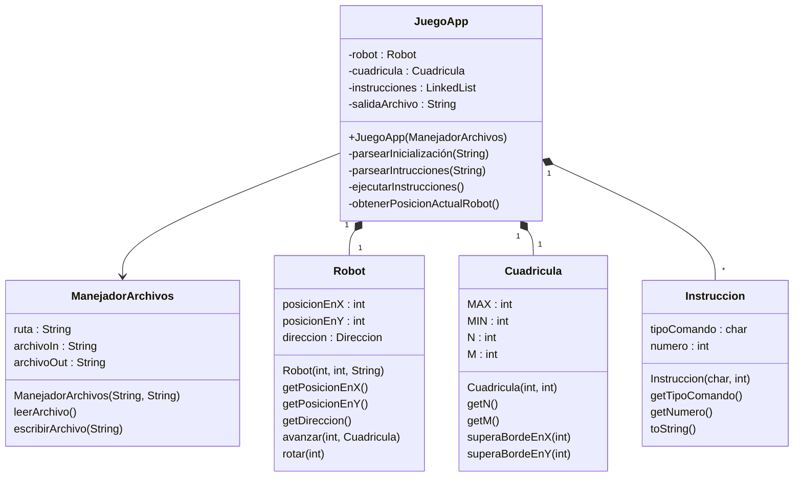

# POO II - 1er Parcial
Parte práctica del 1er Parcial de POO II - 2022 (1er Cuatrimestre)

## Integrantes
- Rocío Alvarado
- Mariana Madeira

## Descripción
Un robot móvil se desplaza en una cuadrícula de N por M cuadraditos sin salirse de ella. El robot sólo obedece a dos tipos de órdenes: una que indica que ángulo debe girar sobre sí mismo y otra que indica cuántos cuadraditos debe avanzar en sentido en el que estaba apuntando. Para que el robot avance una cantidad de cuadraditos en una dirección dada, primero debemos hacerlo girar para que quede apuntando en el sentido deseado y luego darle la orden de avance.

## Casos de Prueba
- **Nombre:** caso_01_entrada_varios_comandos
- **Descripción:** Busca detectar un error en caso de tener una entrada con muchos comandos.

  | IN                                                          | OUT (esperado) |
  |-------------------------------------------------------------|----------------|
  | 5 5 S 15 20 A4A5A2R3A1R9A2R2A6R9A2A3A8A7R2A6R1A7R3A5R1A5 | 4 2            |
---
- **Nombre:** caso_02_entrada_un_comando
- **Descripción:** Busca detectar un error cuando se tiene un único valor de entrada.

  | IN                | OUT (esperado) |
  |-------------------|----------------|
  | 1 4 N 10 10 A4 | 1 8            |
---
- **Nombre:** caso_03_entrada_No_tiene_comandos
- **Descripción:** Busca detectar un error cuando el robot no reciba comandos.
  | IN             | OUT (esperado) |
  |----------------|----------------|
  | 5 2 E 10 20  | 5 2            |
---
- **Nombre:** caso_04_entrada_supera_tamaño_cuadricula
- **Descripción:** Busca detectar un error cuando se ingresa un tamaño de cuadricula más grande que 100.

  | IN                        | OUT (esperado)                                              |
  |---------------------------|-------------------------------------------------------------|
  | 1 1 O 101 100 A2A3R4A7 | “No puede generarse una cuadrícula que supere N=100 o M=100”|           |
---
- **Nombre:** caso_05_entrada_falta_dato_inicializacion
- **Descripción:** Busca detectar un error en caso de tener una entrada con menos datos de inicialización de los necesarios.

  | IN                | OUT (esperado)                                                      |
  |-------------------|---------------------------------------------------------------------|
  | 5 15 20 A7R1A9 |“No puede ejecutarse el programa por faltar datos de inicialización” |
---
- **Nombre:** caso_06_posicion_supera_limite_cuadricula
- **Descripción:** Busca detectar un error cuando se tiene un comando que el avance supera el tamaño de la cuadricula.

  | IN                | OUT (esperado) |
  |-------------------|----------------|
  | 5 10 O 12 12  A4A5A2R3A1R9A2R2A6 | 7 1            |

## Diagrama de Clases

