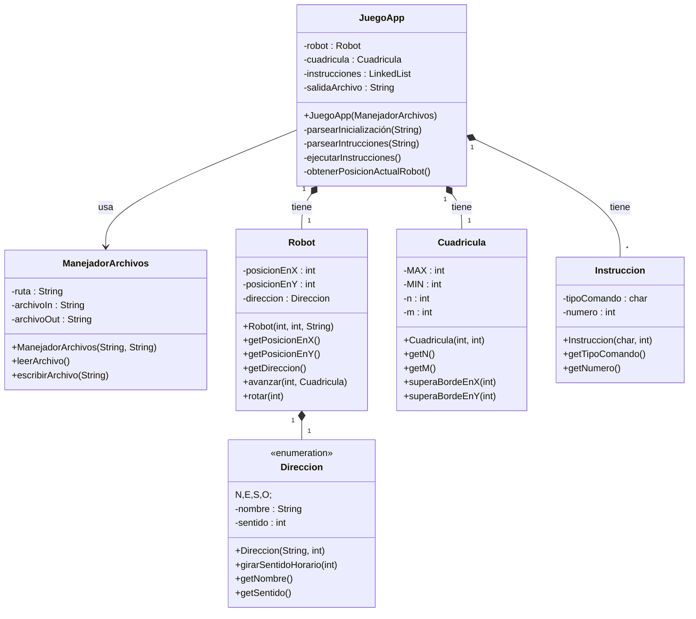

# POO II - 1er Parcial
Parte práctica del 1er Parcial de POO II - 2022 (1er Cuatrimestre)

## Integrantes
- Rocío Alvarado
- Mariana Madeira

## Descripción
Un robot móvil se desplaza en una cuadrícula de N por M cuadraditos sin salirse de ella. El robot sólo obedece a dos tipos de órdenes: una que indica que ángulo debe girar sobre sí mismo y otra que indica cuántos cuadraditos debe avanzar en sentido en el que estaba apuntando. Para que el robot avance una cantidad de cuadraditos en una dirección dada, primero debemos hacerlo girar para que quede apuntando en el sentido deseado y luego darle la orden de avance. 

Para llevar a cabo la ejecución del programa se planteó tener cinco clases, en la cual la clase `JuegoApp` contenga objetos de las clases necesarias para poner en marcha las instrucciones recibidas por archivo para el movimiento del robot. La misma contiene un objeto `cuadrícula` (el cual consta del tamaño `N`, `M` de la cuadrícula y su `máximo` aceptable para dichos valores), un objeto `robot` (el mismo contiene como atributos a su posición `x` e `y` y la `dirección` en la que se encuentra mirando) y un objeto instrucciones que se va cargando a medida que se lee el archivo recibido por parámetro desde la clase manejador de archivo (el cual también inicializará a los demás objetos con los valores de inicio). Al entrar al constructor de `JuegoApp` se realizarán las correspondientes validaciones de la cantidad de instrucciones, cantidad de datos y valor de datos, mientras se realiza el guardado de las mismas en un arreglo. Este se utilizará para ir moviendo al robot a través del método `ejecutarInstrucciones`, el cual consumirá los métodos `avanzar` y `rotar` del objeto `robot`. Se decidió utilizar un enum `Direccion`, para los puntos cardinales (para los que girará el robot), en el que se tiene un método que evaluando la cantidad de veces que el robot tenga que rotar por instrucción y dependiendo del lugar donde se encuentre mirando, retorna la dirección hacia donde quedaría mirando el objeto robot.  

Para ejecutar el programa se deberá tener un archivo llamado “ROBOT.IN” que contenga los valores de inicialización de robot y cuadricula, y los comandos para que se mueva el robot. Al finalizar el programa creará un archivo out llamado “ROBOT.OUT” con la posición final del robot.

A su vez se generaron testJunit con casos de prueba en los métodos `avanzar` y `rotar` y en la ejecución de la lectura de los archivos `.in`  adjuntados en la entrega.

## Complejidad Computacional
La complejidad computacional lograda con este programa es de **O(2.n)**. Podría considerarse el 2 como despreciable, quedándonos finalmente una complejidad de **O(n)**. 

## Casos de Prueba
- **Nombre:** caso_01_entrada_varios_comandos
- **Descripción:** Busca detectar un error en caso de tener una entrada con muchos comandos.

  | IN                                                          | OUT (esperado) |
  |-------------------------------------------------------------|----------------|
  | 5 5 S 15 20 A4A5A2R3A1R9A2R2A6R9A2A3A8A7R2A6R1A7R3A5R1A5 | 4 2            |
---
- **Nombre:** caso_02_entrada_un_comando
- **Descripción:** Busca detectar un error cuando se tiene un único valor de entrada.

  | IN                | OUT (esperado) |
  |-------------------|----------------|
  | 1 4 N 10 10 A4 | 1 8            |
---
- **Nombre:** caso_03_entrada_No_tiene_comandos
- **Descripción:** Busca detectar un error cuando el robot no reciba comandos.
  | IN             | OUT (esperado) |
  |----------------|----------------|
  | 5 2 E 10 20  | 5 2            |
---
- **Nombre:** caso_04_entrada_supera_tamaño_cuadricula
- **Descripción:** Busca detectar un error cuando se ingresa un tamaño de cuadricula más grande que 100.

  | IN                        | OUT (esperado)                                              |
  |---------------------------|-------------------------------------------------------------|
  | 1 1 O 101 100 A2A3R4A7 | “No puede generarse una cuadrícula que supere N=100 o M=100”| 
---
- **Nombre:** caso_05_entrada_falta_dato_inicializacion
- **Descripción:** Busca detectar un error en caso de tener una entrada con menos datos de inicialización de los necesarios.

  | IN                | OUT (esperado)                                                      |
  |-------------------|---------------------------------------------------------------------|
  | 5 15 20 A7R1A9 |“No puede ejecutarse el programa por faltar datos de inicialización” |
---
- **Nombre:** caso_06_posicion_supera_limite_cuadricula
- **Descripción:** Busca detectar un error cuando se tiene un comando que el avance supera el tamaño de la cuadricula.

  | IN                                  | OUT (esperado) |
  |-------------------------------------|----------------|
  | 5 10 O 12 12 A4A5A2R3A1R9A2R2A6 | 7 1            |
---
- **Nombre:** Caso_De_Stress
- **Descripción:** Se busca detectar algún error llevando al programa a su ejecución límite (125 comandos)

  | IN                                  | OUT (esperado) |
  |-------------------------------------|----------------|
  | 5 15 N 15 15  A4A5A2R3A1R9A2R2A6R9A2A3A8A7R2A6R1A7R3A5R1A5A4A5A2R3A1R9A2R2A6R9A2A3A8A7R2A6R1A7R3A5R1A5A4A5A2R3A1R9A2R2A6R9A2A3A8A7R2A6R1A7R3A5R1A5A4A5A2R3A1R9A2R2A6R9A2A3A8A7R2A6R1A7R3A5R1A5A4A5A2R3A1R9A2R2A6R9A2A3A8A7R2A6R1A7R3A5R1A5 | 12 1    |
  
 ## Diagrama de Clases

